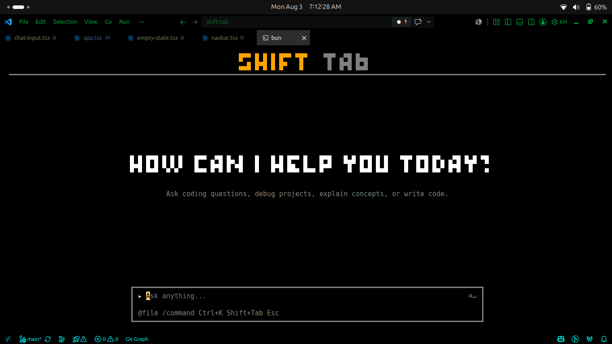

# ShiftTab

A terminal-native AI chat interface built with [opentui](https://github.com/opentui/opentui) and React. Runs entirely in your terminal — no browser, no Electron.

## Features

- **Terminal-native** — renders directly in your TTY using opentui's buffer renderer, no web view involved
- **ASCII branding** — the ShiftTab wordmark is rendered with opentui's built-in ASCII font engine
- **Auto-scrolling chat** — sticky-bottom scroll that follows new messages and detaches when you scroll up to read history
- **Word-wrapped messages** — long responses wrap cleanly to the viewport width
- **Keyboard-first** — submit with `Enter`, navigate history, no mouse required

## Stack

| Layer | Library |
|---|---|
| Terminal renderer | [`@opentui/core`](https://github.com/nicholasleedev/opentui) |
| UI components | React (opentui's reconciler) |
| Language | TypeScript |
